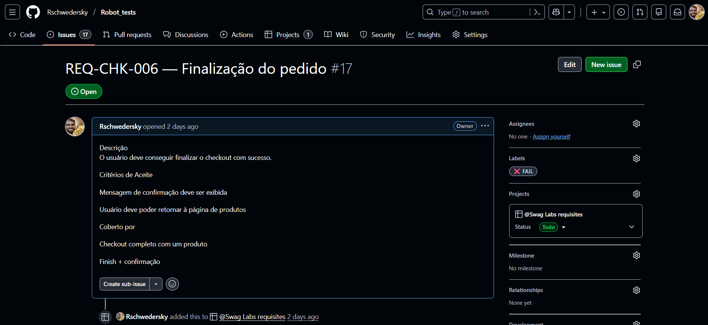
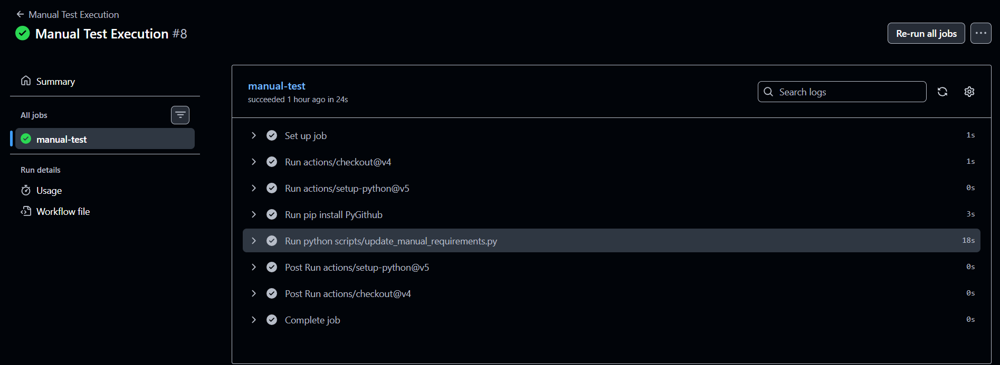
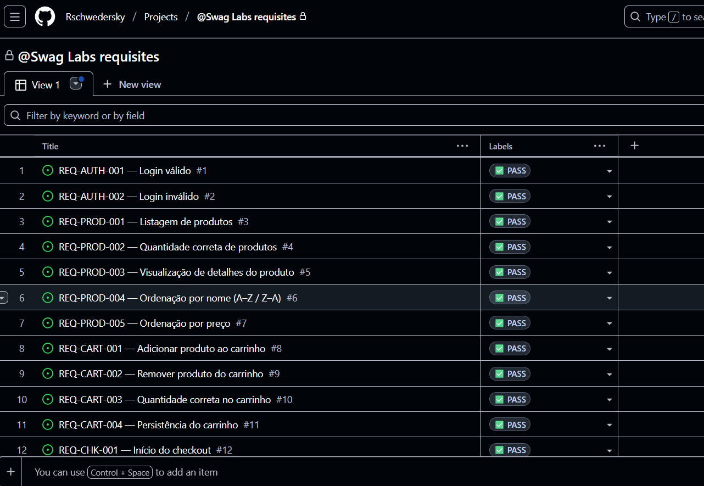

Robot Framework E2E Testing Project

This repository implements an end-to-end testing strategy using Robot Framework, GitHub Actions, and GitHub Issues / Projects to provide full traceability from requirements to execution, without polluting the repository with test results or artifacts.

The goal is to keep the repository clean and maintainable, while execution evidence and status live where they belong: in workflow runs and issues.

📌 Project Objectives

Automate critical user flows using Robot Framework

Maintain clear traceability between:

Requirements

Automated tests

Manual test procedures

Executions (CI and manual)

Avoid storing execution data in the repository

Enable both automated and manual executions through GitHub Actions

Keep the solution simple, auditable, and scalable

🧱 High-Level Architecture
Repository (definition)
│
├─ Tests (Robot Framework)
├─ Manual Procedures (docs)
├─ Scripts (automation glue)
└─ Workflows (execution)

GitHub Actions (execution)
│
├─ Automated test runs
├─ Manual executions
└─ Artifacts (logs, evidence)

GitHub Issues / Projects (traceability)
│
├─ Requirements (REQ-*)
├─ Procedures (PROC-*)
└─ Execution status (labels + comments)

📂 Repository Structure
.
├─ tests/                     # Robot Framework test suites
├─ resources/                 # Keywords and shared logic
├─ procedures/                # Manual test procedures (PROC-*)
├─ scripts/
│   ├─ update_requirements_labels.py
│   └─ update_manual_requirements.py
├─ .github/
│   └─ workflows/
│       ├─ robot-e2e.yml
│       └─ manual-execution.yml
├─ requirements.txt
└─ README.md

🧪 Automated Tests (Robot Framework)

Tests are written in Robot Framework
Each test is tagged with one or more requirement IDs (e.g. REQ-CART-001)
Execution produces standard Robot artifacts:

output.xml
log.html
report.html

⚠️ Important:
These artifacts are not committed to the repository.
They are uploaded only to the workflow run.

⚙️ CI Execution (GitHub Actions)

Automated tests can be executed:
Manually via workflow_dispatch
Nightly via scheduled runs

The workflow:

Installs dependencies
Executes Robot tests
Uploads artifacts to the workflow
Parses test results
Updates requirement issues with:
✅ Pass
❌ Fail

Workflow Run Example

Link to workflow:  
https://github.com/Rschwedersky/Robot_tests/actions/workflows/robot-tests.yml

📋 Requirements Management

Requirements are tracked as GitHub Issues:
Naming convention: REQ-XXX-YYY
One issue per requirement
Used as the single source of truth for status
Status Updates
Requirement issues are updated automatically:
Labels indicate execution result (✅ Pass / ❌ Fail)
Comments reference the workflow run that produced the result

Requirement Issue

https://github.com/Rschwedersky/Robot_tests/issues/17

🧾 Manual Test Procedures

Manual procedures are defined as documentation, not tests.

Naming convention: PROC-XXX

Each procedure lists:+
Objective
Preconditions
Steps
Validations
Covered requirements

Example:

PROC-001 — Complete Purchase Flow
Covers:
- REQ-AUTH-001
- REQ-CART-001
- REQ-CHK-001

Procedures are intentionally decoupled from automation:
One procedure may cover multiple requirements
One requirement may be covered by multiple procedures

🧑‍🔧 Manual Execution via Workflow

Manual executions are triggered via a dedicated GitHub Actions workflow.
Inputs:
Procedure ID (e.g. PROC-001)
Execution result (pass / fail)

The workflow:

Records the execution
Links the run to all covered requirements
Updates requirement labels accordingly

Manual Workflow Input

https://github.com/Rschwedersky/Robot_tests/actions/runs/20461606889/job/58795432543

🔗 Traceability Model
Element	Lives where
Test definitions	Repository
Procedures	Repository
Execution evidence	Workflow runs
Requirement status	Issues
Coverage view	GitHub Projects

This separation ensures:

Clean Git history
No execution noise in PRs
Clear audit trail

📊 Coverage & Projects

GitHub Projects is used to visualize:

Requirement status
Automated vs manual coverage
Overall quality health

GitHub Project Board

https://github.com/users/Rschwedersky/projects/1/views/1?visibleFields=%5B%22Title%22%2C%22Labels%22%5D

🔐 Security & Secrets

No secrets are stored in the repository
Authentication uses GitHub Secrets
Execution tokens are scoped and replaceable

🧠 Design Principles

Traceability over tooling
Automation where it adds value
Documentation where judgment is required
Execution is ephemeral
Requirements are permanent

🚀 Future Improvements (Optional)

Automatic coverage metrics per requirement
Evidence validation (screenshots / logs)
AI-assisted gap detection
Exportable execution summaries

📎 Summary

This project demonstrates a practical, senior-level approach to test automation and quality management using GitHub as a unified platform:

No custom TMS
No repository pollution
Clear ownership and traceability
Scales from small projects to enterprise workflows